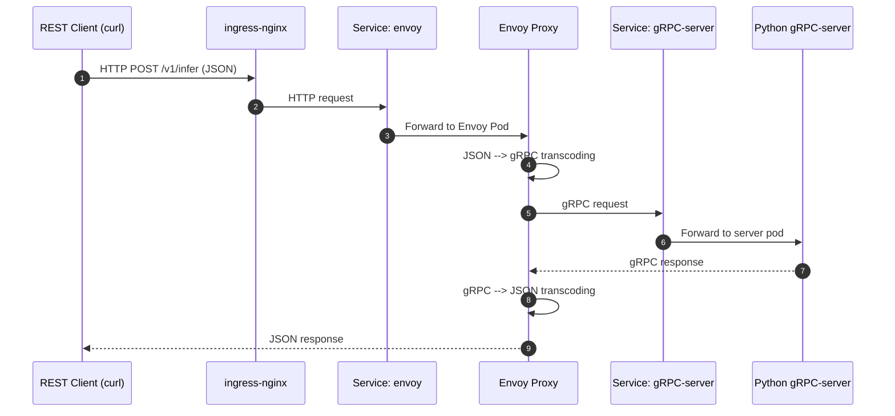
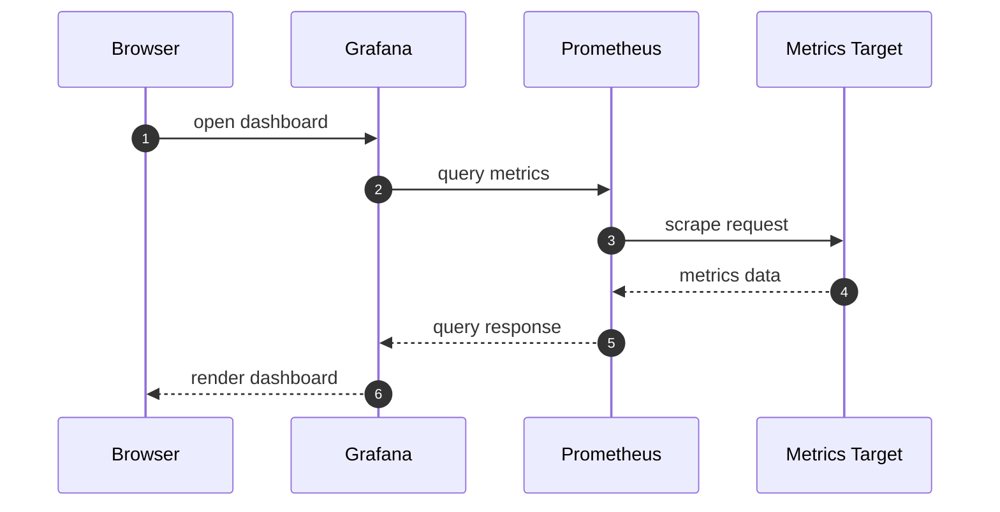
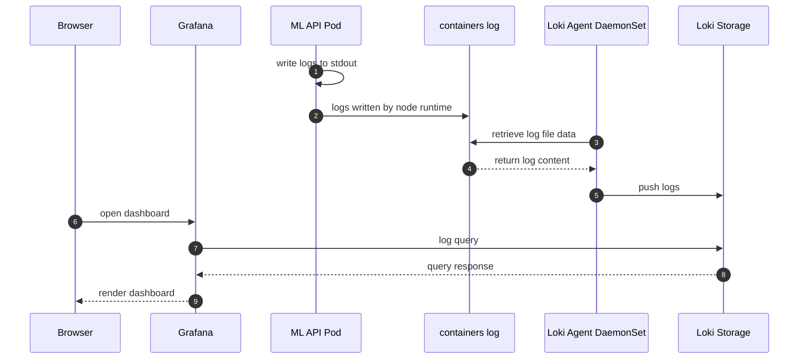
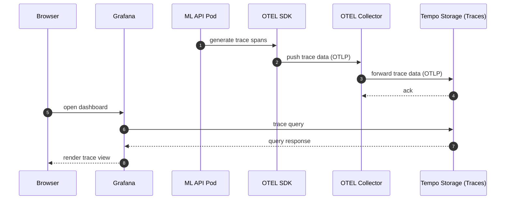

# k8s-ml-inference-platform

## Architecture Overview



## Requirements

Install the following tools:

```bash
brew install colima      # Docker runtime for macOS
brew install kind        # Kubernetes-in-Docker
brew install kubectl     # Kubernetes CLI
```

## SetUp

```
colima start --arch aarch64

# create cluster if not exists ( idempotent )
sh scripts/restart.sh
```

## Monitoring

### Grafana

http://localhost:30091/

### Prometheus

http://localhost:30090/



### Loki




### OpenTelemetry (OTEL)



### MinIO

http://localhost:9001/browser/tempo-traces

```
kubectl port-forward deployment/minio 9001:9001
```
