# k8s-ml-inference-platform

## Architecture Overview

```mermaid
sequenceDiagram
    autonumber

    participant Client as REST Client (curl)
    participant Ingress as ingress-nginx
    participant EnvoySvc as Service: envoy
    participant Envoy as Envoy Proxy
    participant GrpcSvc as Service: gRPC-server
    participant Grpc as Python gRPC-server

    Client->>Ingress: HTTP POST /v1/infer (JSON)
    Ingress->>EnvoySvc: HTTP request
    EnvoySvc->>Envoy: Forward to Envoy Pod
    Envoy->>Envoy: JSON → gRPC transcoding
    Envoy->>GrpcSvc: gRPC request
    GrpcSvc->>Grpc: Forward to server pod
    Grpc-->>Envoy: gRPC response
    Envoy-->>Client: JSON response
```



## Requirements

Install the following tools:

```bash
brew install colima      # Docker runtime for macOS
brew install kind        # Kubernetes-in-Docker
brew install kubectl     # Kubernetes CLI
```

## SetUp

```
colima start --arch aarch64

# create cluster if not exists ( idempotent )
sh scripts/restart.sh
```

